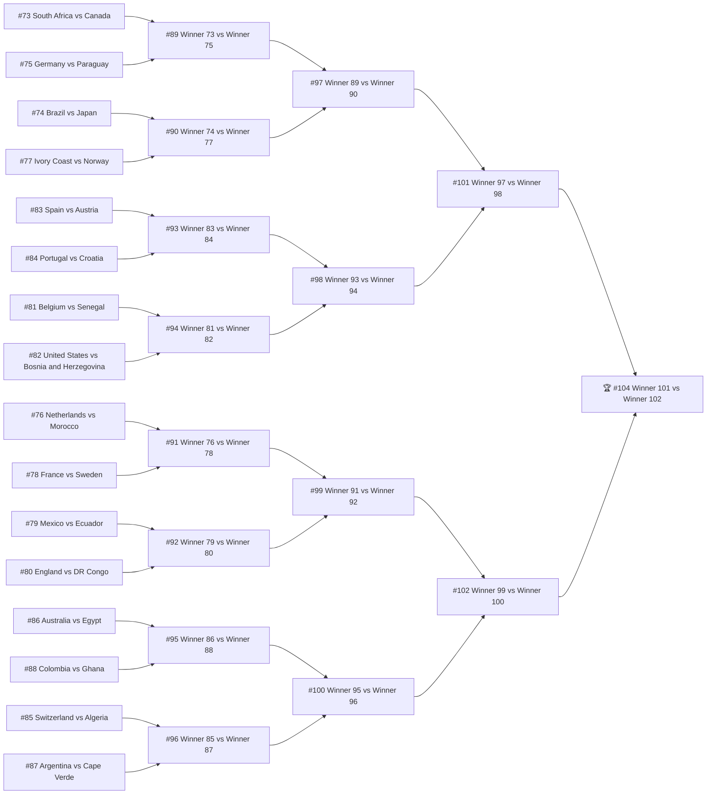

---
{"dg-publish":true,"dg-permalink":"wc2026","permalink":"/wc2026/","tags":["football","WorldCup2026"],"dg-note-properties":{"created":"2026-06-12","updated":"2026-06-17","author":"Claude Code","tags":["football","WorldCup2026"]}}
---

# FIFA World Cup 2026

## Group Stage

### Group A

- [x] 03:00-05:00 Mexico 2-0 South Africa ⏳ 2026-06-12
    - ⚽ Mexico: Quiñones 9', Jiménez 67'
- [x] 10:00-12:00 South Korea 2-1 Czech Republic ⏳ 2026-06-12
    - ⚽ South Korea: In-Beom 67', Hyeon-Gyu 80'
    - ⚽ Czech Republic: Krejcí 59'
- [x] 00:00-02:00 Czech Republic 1-1 South Africa ⏳ 2026-06-19
    - ⚽ Czech Republic: Sadílek 6'
    - ⚽ South Africa: Mokoena 83' (P)
- [x] 09:00-11:00 Mexico 1-0 South Korea ⏳ 2026-06-19 ✅ 2026-06-19
    - ⚽ Mexico: Romo 50'
- [x] 09:00-11:00 Czech Republic 0-3 Mexico ⏳ 2026-06-25
    - ⚽ Mexico: Chávez 55', Quiñones 61', Fidalgo 90'+4'
- [x] 09:00-11:00 South Africa 1-0 South Korea ⏳ 2026-06-25
    - ⚽ South Africa: Maseko 63'

<!-- wc-standings:A start -->
**Standings**

| #   | Team            | Pld | W   | D   | L   | GF  | GA  | GD  | Pts |
| --- | --------------- | --- | --- | --- | --- | --- | --- | --- | --- |
| 1   | Mexico 🟢       | 3   | 3   | 0   | 0   | 6   | 0   | +6  | 9   |
| 2   | South Africa 🟢 | 3   | 1   | 1   | 1   | 2   | 3   | -1  | 4   |
| 3   | South Korea 🟡  | 3   | 1   | 0   | 2   | 2   | 3   | -1  | 3   |
| 4   | Czech Republic  | 3   | 0   | 1   | 2   | 2   | 6   | -4  | 1   |

<!-- wc-standings:A end -->

### Group B

- [x] 03:00-05:00 Canada 1-1 Bosnia and Herzegovina ⏳ 2026-06-13
    - ⚽ Canada: Larin 78'
    - ⚽ Bosnia and Herzegovina: Lukic 21'
- [x] 03:00-05:00 Qatar 1-1 Switzerland ⏳ 2026-06-14
    - ⚽ Qatar: Muheim 90'+4' (OG)
    - ⚽ Switzerland: Embolo 17' (P)
- [x] 03:00-05:00 Switzerland 4-1 Bosnia and Herzegovina ⏳ 2026-06-19
    - ⚽ Switzerland: Manzambi 74', Vargas 84', Manzambi 90', Xhaka 90'+7' (P)
    - ⚽ Bosnia and Herzegovina: Mahmic 90'+3'
- [x] 06:00-08:00 Canada 6-0 Qatar ⏳ 2026-06-19
    - ⚽ Canada: Larin 16', David 29', David 45'+3', Saliba 64', Manai 75' (OG), David 90'+2'
- [x] 03:00-05:00 Switzerland 2-1 Canada ⏳ 2026-06-25 ✅ 2026-06-25
    - ⚽ Switzerland: Vargas 46', Manzambi 57'
    - ⚽ Canada: David 76'
- [x] 03:00-05:00 Bosnia and Herzegovina 3-1 Qatar ⏳ 2026-06-25
    - ⚽ Bosnia and Herzegovina: Alajbegovic 29', Abunada 34' (OG), Mahmic 80'
    - ⚽ Qatar: Al-Haydos 42'

<!-- wc-standings:B start -->
**Standings**

| #   | Team                      | Pld | W   | D   | L   | GF  | GA  | GD  | Pts |
| --- | ------------------------- | --- | --- | --- | --- | --- | --- | --- | --- |
| 1   | Switzerland 🟢            | 3   | 2   | 1   | 0   | 7   | 3   | +4  | 7   |
| 2   | Canada 🟢                 | 3   | 1   | 1   | 1   | 8   | 3   | +5  | 4   |
| 3   | Bosnia and Herzegovina 🟡 | 3   | 1   | 1   | 1   | 5   | 6   | -1  | 4   |
| 4   | Qatar                     | 3   | 0   | 1   | 2   | 2   | 10  | -8  | 1   |

<!-- wc-standings:B end -->

### Group C

- [x] 06:00-08:00 Brazil 1-1 Morocco ⏳ 2026-06-14 ✅ 2026-06-14
    - ⚽ Brazil: Júnior 32'
    - ⚽ Morocco: Saibari 21'
- [x] 09:00-11:00 Haiti 0-1 Scotland ⏳ 2026-06-14 ✅ 2026-06-14
    - ⚽ Scotland: McGinn 28'
- [x] 06:00-08:00 Scotland 0-1 Morocco ⏳ 2026-06-20 ✅ 2026-06-20
    - ⚽ Morocco: Saibari 2'
- [x] 08:30-10:30 Brazil 3-0 Haiti ⏳ 2026-06-20 ✅ 2026-06-20
    - ⚽ Brazil: Cunha 23', Cunha 36', Júnior 45'+3'
- [x] 06:00-08:00 Scotland 0-3 Brazil ⏳ 2026-06-25 ✅ 2026-06-25
    - ⚽ Brazil: Júnior 7', Júnior 45'+3', Cunha 60'
- [x] 06:00-08:00 Morocco 4-2 Haiti ⏳ 2026-06-25 ✅ 2026-06-25
    - ⚽ Morocco: Hakimi 39', Saibari 45'+1', Rahimi 78', Yassine 89'
    - ⚽ Haiti: Bounou 10' (OG), Isidor 43'

<!-- wc-standings:C start -->
**Standings**

| # | Team | Pld | W | D | L | GF | GA | GD | Pts |
|---|------|-----|---|---|---|----|----|----|-----|
| 1 | Brazil 🟢 | 3 | 2 | 1 | 0 | 7 | 1 | +6 | 7 |
| 2 | Morocco 🟢 | 3 | 2 | 1 | 0 | 6 | 3 | +3 | 7 |
| 3 | Scotland 🟡 | 3 | 1 | 0 | 2 | 1 | 4 | -3 | 3 |
| 4 | Haiti | 3 | 0 | 0 | 3 | 2 | 8 | -6 | 0 |

<!-- wc-standings:C end -->

### Group D

- [x] 09:00-11:00 United States 4-1 Paraguay ⏳ 2026-06-13 ✅ 2026-06-13
    - ⚽ United States: Bobadilla 7' (OG), Balogun 31', Balogun 45'+5', Reyna 90'+8'
    - ⚽ Paraguay: Maurício 73'
- [x] 12:00-14:00 Australia 2-0 Turkey ⏳ 2026-06-14 ✅ 2026-06-14
    - ⚽ Australia: Irankunda 27', Metcalfe 75'
- [x] 03:00-05:00 United States 2-0 Australia ⏳ 2026-06-20
    - ⚽ United States: Burgess 11' (OG), Freeman 43'
- [x] 11:00-13:00 Turkey 0-1 Paraguay ⏳ 2026-06-20 ✅ 2026-06-20
    - ⚽ Paraguay: Galarza 2'
- [x] 10:00-12:00 Turkey 3-2 United States ⏳ 2026-06-26 ✅ 2026-06-26
    - ⚽ Turkey: Güler 10', Yilmaz 31', Ayhan 90'+8'
    - ⚽ United States: Trusty 3', Berhalter 49'
- [x] 10:00-12:00 Paraguay 0-0 Australia ⏳ 2026-06-26

<!-- wc-standings:D start -->
**Standings**

| # | Team | Pld | W | D | L | GF | GA | GD | Pts |
|---|------|-----|---|---|---|----|----|----|-----|
| 1 | United States 🟢 | 3 | 2 | 0 | 1 | 8 | 4 | +4 | 6 |
| 2 | Australia 🟢 | 3 | 1 | 1 | 1 | 2 | 2 | +0 | 4 |
| 3 | Paraguay 🟡 | 3 | 1 | 1 | 1 | 2 | 4 | -2 | 4 |
| 4 | Turkey | 3 | 1 | 0 | 2 | 3 | 5 | -2 | 3 |

<!-- wc-standings:D end -->

### Group E

- [x] 01:00-03:00 Germany 7-1 Curaçao ⏳ 2026-06-15 ✅ 2026-06-15
    - ⚽ Germany: Nmecha 6', Schlotterbeck 38', Havertz 45'+5' (P), Musiala 47', Brown 68', Undav 78', Havertz 88'
    - ⚽ Curaçao: Comenencia 21'
- [x] 07:00-09:00 Ivory Coast 1-0 Ecuador ⏳ 2026-06-15
    - ⚽ Ivory Coast: Diallo 90'
- [x] 04:00-06:00 Germany 2-1 Ivory Coast ⏳ 2026-06-21 ✅ 2026-06-21
    - ⚽ Germany: Undav 68', Undav 90'+4'
    - ⚽ Ivory Coast: Kessié 30'
- [x] 08:00-10:00 Ecuador 0-0 Curaçao ⏳ 2026-06-21
- [x] 04:00-06:00 Curaçao 0-2 Ivory Coast ⏳ 2026-06-26
    - ⚽ Ivory Coast: Pépé 7', Pépé 64'
- [x] 04:00-06:00 Ecuador 2-1 Germany ⏳ 2026-06-26 ✅ 2026-06-27
    - ⚽ Ecuador: Angulo 9', Plata 77'
    - ⚽ Germany: Sané 2'

<!-- wc-standings:E start -->
**Standings**

| # | Team | Pld | W | D | L | GF | GA | GD | Pts |
|---|------|-----|---|---|---|----|----|----|-----|
| 1 | Germany 🟢 | 3 | 2 | 0 | 1 | 10 | 4 | +6 | 6 |
| 2 | Ivory Coast 🟢 | 3 | 2 | 0 | 1 | 4 | 2 | +2 | 6 |
| 3 | Ecuador 🟡 | 3 | 1 | 1 | 1 | 2 | 2 | +0 | 4 |
| 4 | Curaçao | 3 | 0 | 1 | 2 | 1 | 9 | -8 | 1 |

<!-- wc-standings:E end -->

### Group F

- [x] 04:00-06:00 Netherlands 2-2 Japan ⏳ 2026-06-15 ✅ 2026-06-15
    - ⚽ Netherlands: Dijk 51', Summerville 64'
    - ⚽ Japan: Nakamura 57', Kamada 89'
- [x] 10:00-12:00 Sweden 5-1 Tunisia ⏳ 2026-06-15 ✅ 2026-06-15
    - ⚽ Sweden: Ayari 7', Isak 30', Gyökeres 59', Svanberg 84', Ayari 90'+6'
    - ⚽ Tunisia: Rekik 43'
- [x] 01:00-03:00 Netherlands 5-1 Sweden ⏳ 2026-06-21 ✅ 2026-06-21
    - ⚽ Netherlands: Brobbey 5', Brobbey 17', Gakpo 47', Gakpo 54', Summerville 89'
    - ⚽ Sweden: Elanga 59'
- [x] 12:00-14:00 Tunisia 0-4 Japan ⏳ 2026-06-21 ✅ 2026-06-21
    - ⚽ Japan: Kamada 4', Ueda 31', Ito 69', Ueda 83'
- [x] 07:00-09:00 Japan 1-1 Sweden ⏳ 2026-06-26 ✅ 2026-06-26
    - ⚽ Japan: Maeda 56'
    - ⚽ Sweden: Elanga 62'
- [x] 07:00-09:00 Tunisia 1-3 Netherlands ⏳ 2026-06-26 ✅ 2026-06-26
    - ⚽ Tunisia: Mastouri 54'
    - ⚽ Netherlands: Skhiri 3' (OG), Brobbey 7', Hecke 62'

<!-- wc-standings:F start -->
**Standings**

| # | Team | Pld | W | D | L | GF | GA | GD | Pts |
|---|------|-----|---|---|---|----|----|----|-----|
| 1 | Netherlands 🟢 | 3 | 2 | 1 | 0 | 10 | 4 | +6 | 7 |
| 2 | Japan 🟢 | 3 | 1 | 2 | 0 | 7 | 3 | +4 | 5 |
| 3 | Sweden 🟡 | 3 | 1 | 1 | 1 | 7 | 7 | +0 | 4 |
| 4 | Tunisia | 3 | 0 | 0 | 3 | 2 | 12 | -10 | 0 |

<!-- wc-standings:F end -->

### Group G

- [x] 03:00-05:00 Belgium 1-1 Egypt ⏳ 2026-06-16 ✅ 2026-06-16
    - ⚽ Belgium: Hany 66' (OG)
    - ⚽ Egypt: Ashour 19'
- [x] 09:00-11:00 Iran 2-2 New Zealand ⏳ 2026-06-16
    - ⚽ Iran: Rezaeian 32', Mohebbi 64'
    - ⚽ New Zealand: Just 7', Just 54'
- [x] 03:00-05:00 Belgium 0-0 Iran ⏳ 2026-06-22
- [x] 09:00-11:00 New Zealand 1-3 Egypt ⏳ 2026-06-22 ✅ 2026-06-25
    - ⚽ New Zealand: Surman 15'
    - ⚽ Egypt: Zico 58', Salah 67', Trézéguet 82'
- [x] 11:00-13:00 Egypt 1-1 Iran ⏳ 2026-06-27 ✅ 2026-06-27
    - ⚽ Egypt: Saber 5'
    - ⚽ Iran: Rezaeian 14'
- [x] 11:00-13:00 New Zealand 1-5 Belgium ⏳ 2026-06-27 ✅ 2026-06-27
    - ⚽ New Zealand: Just 84'
    - ⚽ Belgium: Trossard 28', Trossard 50', Bruyne 66', Lukaku 86', Saelemaekers 90'+4'

<!-- wc-standings:G start -->
**Standings**

| #   | Team        | Pld | W   | D   | L   | GF  | GA  | GD  | Pts |
| --- | ----------- | --- | --- | --- | --- | --- | --- | --- | --- |
| 1   | Belgium 🟢  | 3   | 1   | 2   | 0   | 6   | 2   | +4  | 5   |
| 2   | Egypt 🟢    | 3   | 1   | 2   | 0   | 5   | 3   | +2  | 5   |
| 3   | Iran 🟡     | 3   | 0   | 3   | 0   | 3   | 3   | +0  | 3   |
| 4   | New Zealand | 3   | 0   | 1   | 2   | 4   | 10  | -6  | 1   |

<!-- wc-standings:G end -->

### Group H

- [x] 00:00-02:00 Spain 0-0 Cape Verde ⏳ 2026-06-16 ✅ 2026-06-16
- [x] 06:00-08:00 Saudi Arabia 1-1 Uruguay ⏳ 2026-06-16 ✅ 2026-06-16
    - ⚽ Saudi Arabia: Al-Amri 41'
    - ⚽ Uruguay: Araújo 80'
- [x] 00:00-02:00 Spain 4-0 Saudi Arabia ⏳ 2026-06-22 ✅ 2026-06-23
    - ⚽ Spain: Yamal 10', Oyarzabal 21', Oyarzabal 24', Al-Tambakti 49' (OG)
- [x] 06:00-08:00 Uruguay 2-2 Cape Verde ⏳ 2026-06-22 ✅ 2026-06-25
    - ⚽ Uruguay: Araújo 44', Canobbio 45'+6'
    - ⚽ Cape Verde: Pina 21', Varela 61'
- [x] 08:00-10:00 Cape Verde 0-0 Saudi Arabia ⏳ 2026-06-27
- [x] 08:00-10:00 Uruguay 0-1 Spain ⏳ 2026-06-27 ✅ 2026-06-27
    - ⚽ Spain: Baena 42'

<!-- wc-standings:H start -->
**Standings**

| #   | Team          | Pld | W   | D   | L   | GF  | GA  | GD  | Pts |
| --- | ------------- | --- | --- | --- | --- | --- | --- | --- | --- |
| 1   | Spain 🟢      | 3   | 2   | 1   | 0   | 5   | 0   | +5  | 7   |
| 2   | Cape Verde 🟢 | 3   | 0   | 3   | 0   | 2   | 2   | +0  | 3   |
| 3   | Uruguay 🟡    | 3   | 0   | 2   | 1   | 3   | 4   | -1  | 2   |
| 4   | Saudi Arabia  | 3   | 0   | 2   | 1   | 1   | 5   | -4  | 2   |

<!-- wc-standings:H end -->

### Group I

- [x] 03:00-05:00 France 3-1 Senegal ⏳ 2026-06-17
    - ⚽ France: Mbappé 66', Barcola 82', Mbappé 90'+6'
    - ⚽ Senegal: Mbaye 90'+5'
- [x] 06:00-08:00 Iraq 1-4 Norway ⏳ 2026-06-17 ✅ 2026-06-19
    - ⚽ Iraq: Hussein 39'
    - ⚽ Norway: Haaland 29', Haaland 43', Østigard 76', Hussein 90'+6' (OG)
- [x] 05:00-07:00 France 3-0 Iraq ⏳ 2026-06-23 ✅ 2026-06-23
    - ⚽ France: Mbappé 14', Mbappé 54', Dembélé 66'
- [x] 08:00-10:00 Norway 3-2 Senegal ⏳ 2026-06-23 ✅ 2026-06-23
    - ⚽ Norway: Pedersen 43', Haaland 48', Haaland 58'
    - ⚽ Senegal: Sarr 53', Sarr 90'+3'
- [x] 03:00-05:00 Norway 1-4 France ⏳ 2026-06-27 ✅ 2026-06-27
    - ⚽ Norway: Aasgaard 21'
    - ⚽ France: Dembélé 7', Dembélé 20', Dembélé 32', Doué 90'+4'
- [x] 03:00-05:00 Senegal 5-0 Iraq ⏳ 2026-06-27
    - ⚽ Senegal: Diarra 4', Sarr 56', Gueye 59', Gueye 71', Ndiaye 82'

<!-- wc-standings:I start -->
**Standings**

| # | Team | Pld | W | D | L | GF | GA | GD | Pts |
|---|------|-----|---|---|---|----|----|----|-----|
| 1 | France 🟢 | 3 | 3 | 0 | 0 | 10 | 2 | +8 | 9 |
| 2 | Norway 🟢 | 3 | 2 | 0 | 1 | 8 | 7 | +1 | 6 |
| 3 | Senegal 🟡 | 3 | 1 | 0 | 2 | 8 | 6 | +2 | 3 |
| 4 | Iraq | 3 | 0 | 0 | 3 | 1 | 12 | -11 | 0 |

<!-- wc-standings:I end -->

### Group J

- [x] 09:00-11:00 Argentina 3-0 Algeria ⏳ 2026-06-17 ✅ 2026-06-17
    - ⚽ Argentina: Messi 17', Messi 60', Messi 76'
- [x] 12:00-14:00 Austria 3-1 Jordan ⏳ 2026-06-17 ✅ 2026-06-17
    - ⚽ Austria: Schmid 21', Al-Arab 76' (OG), Arnautovic 90'+12' (P)
    - ⚽ Jordan: Olwan 50'
- [x] 01:00-03:00 Argentina 2-0 Austria ⏳ 2026-06-23 ✅ 2026-06-23
    - ⚽ Argentina: Messi 38', Messi 90'+5'
- [x] 11:00-13:00 Jordan 1-2 Algeria ⏳ 2026-06-23 ✅ 2026-06-23
    - ⚽ Jordan: Al-Rashdan 36'
    - ⚽ Algeria: Benbouali 69', Gouiri 82'
- [/] 10:00-12:00 Algeria 3-3 Austria ⏳ 2026-06-28
    - ⚽ Algeria: Belghali 45', Mahrez 60', Mahrez 90'+3'
    - ⚽ Austria: Arnautovic 28', Sabitzer 55', Kalajdzic 90'+6'
- [/] 10:00-12:00 Jordan 1-3 Argentina ⏳ 2026-06-28
    - ⚽ Jordan: Al-Tamari 55'
    - ⚽ Argentina: Celso 19', Martínez 31' (P), Messi 80'

<!-- wc-standings:J start -->
**Standings**

| # | Team | Pld | W | D | L | GF | GA | GD | Pts |
|---|------|-----|---|---|---|----|----|----|-----|
| 1 | Argentina 🟢 | 3 | 3 | 0 | 0 | 8 | 1 | +7 | 9 |
| 2 | Austria 🟢 | 3 | 1 | 1 | 1 | 6 | 6 | +0 | 4 |
| 3 | Algeria 🟡 | 3 | 1 | 1 | 1 | 5 | 7 | -2 | 4 |
| 4 | Jordan | 3 | 0 | 0 | 3 | 3 | 8 | -5 | 0 |

<!-- wc-standings:J end -->

### Group K

- [x] 01:00-03:00 Portugal 1-1 DR Congo ⏳ 2026-06-18  ✅ 2026-06-19
    - ⚽ Portugal: Neves 6'
    - ⚽ DR Congo: Wissa 45'+5'
- [x] 10:00-12:00 Uzbekistan 1-3 Colombia ⏳ 2026-06-18 ✅ 2026-06-18
    - ⚽ Uzbekistan: Fayzullaev 60'
    - ⚽ Colombia: Muñoz 40', Díaz 65', Campaz 90'+9'
- [x] 01:00-03:00 Portugal 5-0 Uzbekistan ⏳ 2026-06-24 ✅ 2026-06-24
    - ⚽ Portugal: Ronaldo 6', Mendes 17', Ronaldo 39', Nematov 60' (OG), Leão 87'
- [x] 10:00-12:00 Colombia 1-0 DR Congo ⏳ 2026-06-24 ✅ 2026-06-24
    - ⚽ Colombia: Muñoz 76'
- [/] 07:30-09:30 Colombia 0-0 Portugal ⏳ 2026-06-28
- [x] 07:30-09:30 DR Congo 3-1 Uzbekistan ⏳ 2026-06-28
    - ⚽ DR Congo: Wissa 68' (P), Mayele 78', Wissa 90'+1'
    - ⚽ Uzbekistan: Shomurodov 10'

<!-- wc-standings:K start -->
**Standings**

| # | Team | Pld | W | D | L | GF | GA | GD | Pts |
|---|------|-----|---|---|---|----|----|----|-----|
| 1 | Colombia 🟢 | 3 | 2 | 1 | 0 | 4 | 1 | +3 | 7 |
| 2 | Portugal 🟢 | 3 | 1 | 2 | 0 | 6 | 1 | +5 | 5 |
| 3 | DR Congo 🟡 | 3 | 1 | 1 | 1 | 4 | 3 | +1 | 4 |
| 4 | Uzbekistan | 3 | 0 | 0 | 3 | 2 | 11 | -9 | 0 |

<!-- wc-standings:K end -->

### Group L

- [x] 04:00-06:00 England 4-2 Croatia ⏳ 2026-06-18 ✅ 2026-06-18
    - ⚽ England: Kane 12' (P), Kane 42', Bellingham 47', Rashford 85'
    - ⚽ Croatia: Baturina 36', Musa 45'+5'
- [x] 07:00-09:00 Ghana 1-0 Panama ⏳ 2026-06-18
    - ⚽ Ghana: Yirenkyi 90'+5'
- [x] 04:00-06:00 England 0-0 Ghana ⏳ 2026-06-24 ✅ 2026-06-24
- [x] 07:00-09:00 Panama 0-1 Croatia ⏳ 2026-06-24
    - ⚽ Croatia: Budimir 54'
- [/] 05:00-07:00 Panama 0-2 England ⏳ 2026-06-28
    - ⚽ England: Bellingham 62', Kane 67'
- [x] 05:00-07:00 Croatia 2-1 Ghana ⏳ 2026-06-28
    - ⚽ Croatia: Sucic 31', Vlasic 83'
    - ⚽ Ghana: Luckassen 73'

<!-- wc-standings:L start -->
**Standings**

| # | Team | Pld | W | D | L | GF | GA | GD | Pts |
|---|------|-----|---|---|---|----|----|----|-----|
| 1 | England 🟢 | 3 | 2 | 1 | 0 | 6 | 2 | +4 | 7 |
| 2 | Croatia 🟢 | 3 | 2 | 0 | 1 | 5 | 5 | +0 | 6 |
| 3 | Ghana 🟡 | 3 | 1 | 1 | 1 | 2 | 2 | +0 | 4 |
| 4 | Panama | 3 | 0 | 0 | 3 | 0 | 4 | -4 | 0 |

<!-- wc-standings:L end -->

---

<!-- wc-thirds start -->
### Best Third-Placed Teams

_12 組第三名取前 8 晉級（積分 → 淨勝球 → 進球）。🟢 ＝ 晉級。_

| # | Grp | Team | Pld | W | D | L | GF | GA | GD | Pts |
|---|-----|------|-----|---|---|---|----|----|----|-----|
| 1 | K | DR Congo 🟢 | 3 | 1 | 1 | 1 | 4 | 3 | +1 | 4 |
| 2 | F | Sweden 🟢 | 3 | 1 | 1 | 1 | 7 | 7 | +0 | 4 |
| 3 | E | Ecuador 🟢 | 3 | 1 | 1 | 1 | 2 | 2 | +0 | 4 |
| 4 | L | Ghana 🟢 | 3 | 1 | 1 | 1 | 2 | 2 | +0 | 4 |
| 5 | B | Bosnia and Herzegovina 🟢 | 3 | 1 | 1 | 1 | 5 | 6 | -1 | 4 |
| 6 | J | Algeria 🟢 | 3 | 1 | 1 | 1 | 5 | 7 | -2 | 4 |
| 7 | D | Paraguay 🟢 | 3 | 1 | 1 | 1 | 2 | 4 | -2 | 4 |
| 8 | I | Senegal 🟢 | 3 | 1 | 0 | 2 | 8 | 6 | +2 | 3 |
| 9 | G | Iran | 3 | 0 | 3 | 0 | 3 | 3 | +0 | 3 |
| 10 | A | South Korea | 3 | 1 | 0 | 2 | 2 | 3 | -1 | 3 |
| 11 | C | Scotland | 3 | 1 | 0 | 2 | 1 | 4 | -3 | 3 |
| 12 | H | Uruguay | 3 | 0 | 2 | 1 | 3 | 4 | -1 | 2 |

<!-- wc-thirds end -->

## Round of 32

- [ ] 03:00-05:00 South Africa vs Canada ⏳ 2026-06-29
- [/] 01:00-03:00 Brazil vs Japan ⏳ 2026-06-30
- [/] 04:30-06:30 Germany vs Paraguay ⏳ 2026-06-30
- [/] 09:00-11:00 Netherlands vs Morocco ⏳ 2026-06-30
- [/] 01:00-03:00 Ivory Coast vs Norway ⏳ 2026-07-01
- [/] 05:00-07:00 France vs Sweden ⏳ 2026-07-01
- [ ] 09:00-11:00 Mexico vs Ecuador ⏳ 2026-07-01
- [/] 00:00-02:00 England vs DR Congo ⏳ 2026-07-02
- [/] 04:00-06:00 Belgium vs Senegal ⏳ 2026-07-02
- [/] 08:00-10:00 United States vs Bosnia and Herzegovina ⏳ 2026-07-02
- [/] 03:00-05:00 Spain vs Austria ⏳ 2026-07-03
- [ ] 07:00-09:00 Portugal vs Croatia ⏳ 2026-07-03
- [/] 11:00-13:00 Switzerland vs Algeria ⏳ 2026-07-03
- [/] 02:00-04:00 Australia vs Egypt ⏳ 2026-07-04
- [/] 06:00-08:00 Argentina vs Cape Verde ⏳ 2026-07-04
- [/] 09:30-11:30 Colombia vs Ghana ⏳ 2026-07-04

---

## Round of 16

- [ ] 01:00-03:00 Winner 73 vs Winner 75 ⏳ 2026-07-05
- [ ] 05:00-07:00 Winner 74 vs Winner 77 ⏳ 2026-07-05
- [ ] 04:00-06:00 Winner 76 vs Winner 78 ⏳ 2026-07-06
- [ ] 08:00-10:00 Winner 79 vs Winner 80 ⏳ 2026-07-06
- [ ] 03:00-05:00 Winner 83 vs Winner 84 ⏳ 2026-07-07
- [ ] 08:00-10:00 Winner 81 vs Winner 82 ⏳ 2026-07-07
- [ ] 00:00-02:00 Winner 86 vs Winner 88 ⏳ 2026-07-08
- [ ] 04:00-06:00 Winner 85 vs Winner 87 ⏳ 2026-07-08

---

## Quarterfinals

- [ ] 04:00-06:00 Winner 89 vs Winner 90 ⏳ 2026-07-10
- [ ] 03:00-05:00 Winner 93 vs Winner 94 ⏳ 2026-07-11
- [ ] 05:00-07:00 Winner 91 vs Winner 92 ⏳ 2026-07-12
- [ ] 09:00-11:00 Winner 95 vs Winner 96 ⏳ 2026-07-12

---

## Semifinals

- [ ] 03:00-05:00 Winner 97 vs Winner 98 ⏳ 2026-07-15
- [ ] 03:00-05:00 Winner 99 vs Winner 100 ⏳ 2026-07-16

---

## Third Place

- [ ] 05:00-07:00 Loser 101 vs Loser 102 ⏳ 2026-07-19

---

## Final

- [ ] 03:00-05:00 Winner 101 vs Winner 102 ⏳ 2026-07-20

<!-- wc-bracket start -->
## Knockout Bracket

_Auto-generated from the knockout fixtures above; each node updates as its match name resolves. `3rd …` slots resolve once the eight best third-placed teams are confirmed. Third-place play-off (#103) omitted._
<!-- wc-bracket end -->
